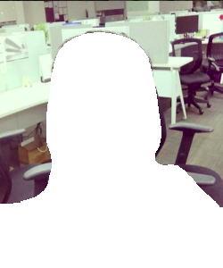

# Background substitution Using deep learning image segmentation
This project demonstrates how we can make use of image segmentation using a fully convolution network for efficient back ground substitution

## Sample

## Description

This task makes use of a pre-trained FCN8s model(trained on pascal-voc) to create a segmentation mask only for the human presence.
After getting the segmentation mask of human, we take the remaining as background mask and do some morphological operations to change the background to anything. Here for simplicity i replaced the background with white colour. Instead if you blurr the background mask and merge the object+background masks together you can get the famous "Bokeh effect"

You may download the FC8s checkpoint from [here](https://www.dropbox.com/s/7r6lnilgt78ljia/fcn_8s.tar.gz?dl=0)

For object available in pascal-voc we can make use of this pretrained model, if you need any other object to be extracted, you will have to train an FCN8s model for that object by collecting a lot of data and manually annotationg the segmentation. Then replace the model here to get the same result for your object
Most of the idea is taken from this [blog](http://warmspringwinds.github.io/tensorflow/tf-slim/2016/10/30/image-classification-and-segmentation-using-tensorflow-and-tf-slim/) series

## Requirements
1.tesnorflow
2.scipy
3.PIL
4.opencv
5.numpy
6.skimage

## About
If you used the code for your research, please, cite the paper:

    @article{pakhomov2017deep,
      title={Deep Residual Learning for Instrument Segmentation in Robotic Surgery},
      author={Pakhomov, Daniil and Premachandran, Vittal and Allan, Max and Azizian, Mahdi and Navab, Nassir},
      journal={arXiv preprint arXiv:1703.08580},
      year={2017}
    }

## refernces
1. https://github.com/warmspringwinds/tf-image-segmentation
